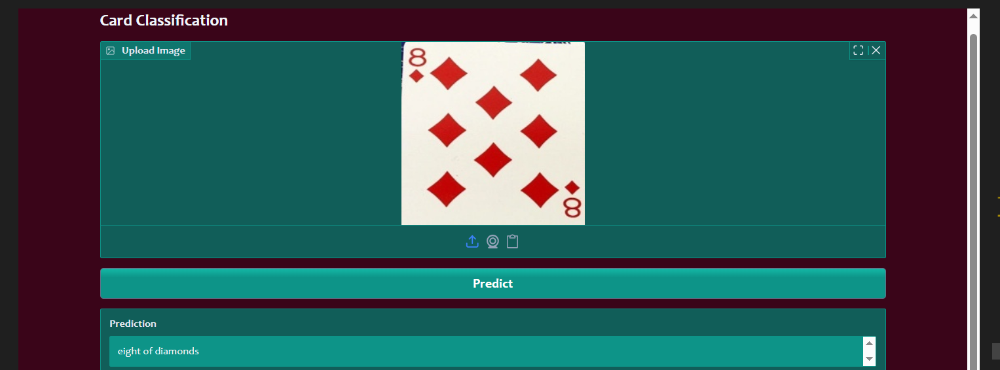
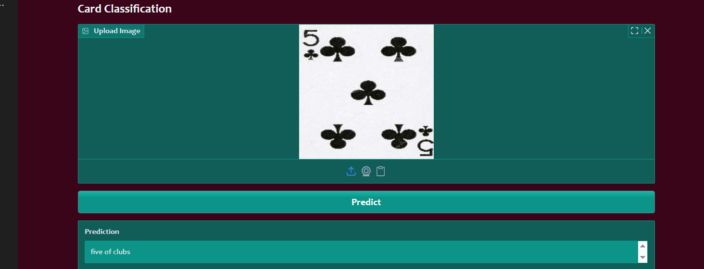
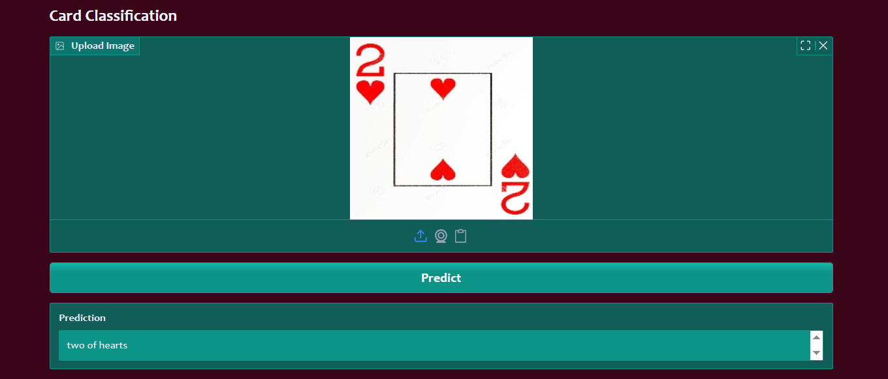

# Card Classification

### first Example pic of Recommend photo


### Second Example pic of Recommend photo


### Third Example pic of Recommend photo



### Create and activate a virtual environment
```
conda create -p cls_venv python==3.12 -y

conda activate cls_venv/

```
### install dependencies
```
pip install -r requirements.txt

```
### Git commands

```
1. git init

2. git add .  or git add README.md notebook text files

3. git commit -m "first commit"

4. git remote remove origin

5. git remote add origin https://github.com/shivarajshelar/card_classification.git

6. git remote -v

7. git branch -M main

8. git push -u origin main

```
## Library are used for this project

1. Pandas
2. Numpy
3. Tensorflow
4. Gradio
5. Matplotlib
6. seaborn


# CNN model 

 
## Preprocessing & augmentation

Recommended preprocessing steps:

- **Resize** to the model input size (e.g., 120×120).
- **Rescale** pixel values to `[0, 1]` (divide by 224.0).
- **Convert to grayscale**: either at dataset load time or by specifying color_mode in the loader.


**Notes on the architecture**:
- Input is grayscale (`channels=1`). If your images are RGB, change `input_shape` to `(H, W, 3)`.
- Two convolutional blocks with BatchNorm + ReLU + MaxPool are used to extract features.
- A small dense head with BatchNorm and ReLU precedes the final softmax output.
- This is intentionally compact. If underfitting, consider more filters, larger dense layers, or additional conv blocks.

---

## Dataset and expected input

- **Classes**: 53 (52 standard cards + 1 joker).
-**Images**: expected to be pre-cropped to the card region and resized to `im_size` (e.g., `im_size = (120,120)`).
- **Channels**: 1 (grayscale). Convert to grayscale when loading.


